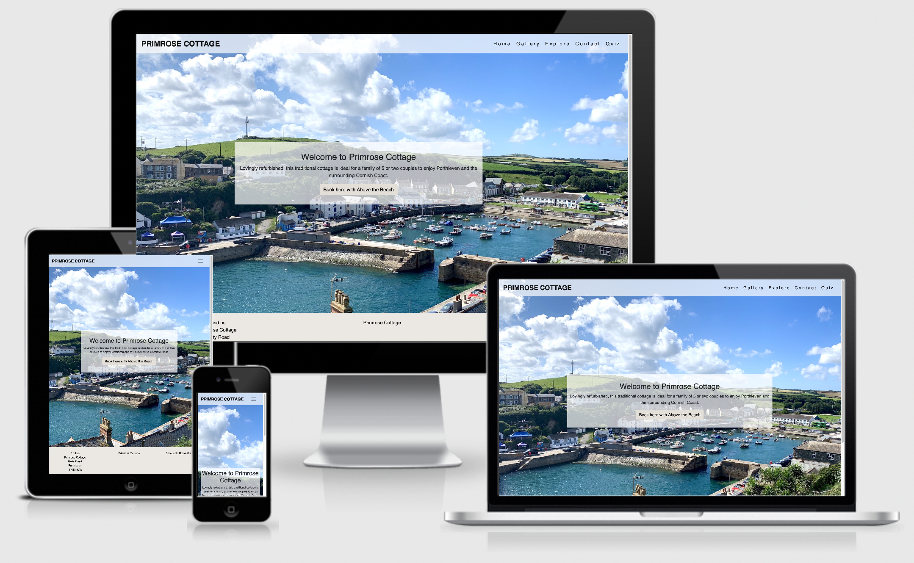

# Primerose Cottage

[View the deplyed website](https://carolinecole25.github.io/CI-MS2-primrose_cottage/)

## Table of Content 
1. [Project Goals](#project-goals)
2. [User Experience](#user-experience)
    1. [User Stories](#user-stories)
    2. [Design choices](#design-choices)
    3. [Fonts](#fonts)
    4. [Colours](#colours)
    5. [Wireframes](#wireframes)
3. [Technologies Used](#technologies-used)
4. [Testing](#testing)
    1. [HTML Validation](#html-validation)
    2. [CSS Validation](#css-validation)
    3. [Accessibility](#accessibility)
    4. [Performance](#performance)
    5. [Javascript](#javascript)
    6. [Testing client stories from UX section](#testing-client-stories-from-ux-section)
5. [Bugs](#bugs)
6. [Deployment](#deployment)
7. [How to run this project locally](#how-to-run-this-project-locally)
8. [Credits](#credits)
    1. [HTML](#html)
    2. [CSS](#css)
    3. [Javascript](#javascript)
    4. [Media](#media)
    5. [Text](#text)
    6. [Acknowledgements](#acknowledgements)

## Project Goals
The primary goal for Primrose Cottage is to provide a userfriendly, fresh and innovative website which leaves users knowing all about Primrose Cottage and it's surrounding areas. My target audience will be 25-60 year olds who are looking for a place to stay in Cornwall. 

My user goals are:
* To view Primrose Cottage website and see it's natural charm.
* The website design to suit the cottage and it's location.
* A visuslly appealing website, leaving users returning and wanting to visit Primrose Cottage.
* Userfriendly wesbite. 

Primerose Cottage website will meet users needs by:
* The website will contain a gallery page which shows interal and external imagery of the cottage.
* The website will contain images of the town the cottage is location, keeping the theme through the website.
* All areas of my websute are clearly layed out and easy to use.
* The website is resposive and easy to navigate through.

### Developer and Business Goals
* Create a professional website which is user friendly, innovative and stylish.
* Use Javascript confidently and incorporate it will within in my website.
* To add this to my portfolio and be be proud of the work I have created.
* Create a website that shows Primrose Cottage's natural charm effortlessly.
* Explore pages to have functioning Google API's and then user to find these user friendly.
* The site to be fully responsive.

## User Experience

### User Stories 

#### Site Users
1. The ability to easily use and navigate the website.
2. Relevant information regarding the cottage, it's location and leaves the users happy with the information provided.
3. A functioning contact us page so if the users does have any questions they can get in touch.
4. Visual icons and images that suit the theme of the website.
5. A fully functioning Explore page with information about the area.
6. Leaves users wanting to escape for a staycation because the website has made the cottage sound idyllic and wanting to explore themselves.
7. User to enjoy playing the quiz on Cornwall, for it to be fully functioning and easy to use.

#### Site Owner 
8. As the site owner I want the customers to easily navigate the website.  
9. As the site owner I want the customers to be able to contact us with any queries. A pop up should appear if any information inputted into the form is incorrect.
10. As the site owner I want users to be able to use the Google Map API to find the location of the cottage and see all about the area.
11. As the site owner I want users to be able to view the cottage well and for the website to contain a good amount of information.
12. As the site owner I want any links on the website to be functioning. 
13. As the site owner, I want the quiz to be fully functioning and the user to have a fun experience. 

### Design choices 
I designed this website using images taken of the town Primrose Cottage is location. I chose to use these images becuase I want the user to know straight away how idyllic the area is so they continue to scroll through the website.
I wanted the page to be easy to read, navigate and have a relaxed feel to it. The following design choices were made with this in mind:

### Fonts
I chose fjalla front with a back up of sans-serif because it is easy to read, simple and stylish. I liked the simplicity of it but the clarity with the bolder font, I thought it went well with the busy images on the page and the overall feel of the website.

### Colours
I chose to use an image as a background to my page which is bright with the colours of the sky, sea and harbour. I am pleased with the outcome of this because it looks effective and shows the users the location as soon as they enter the page.
I chose to use a slightly transparent white background to my navigation bar and the text box containing the introduction to each page. I chose this the colours wouldn't detract from the background image. 
I chose to use black font because I didn't want to destract from the image and I wanted the writing to be easy to read.

### Backgrounds 
I chose to use an image of Porthleven as a background to this website for the index page because that is the town the cottage is location; this suited the theme.
For the rest of the website, I felt the front image was a bit too busy. I changed it to be an image of the a beautiful beach and the sea which I personally took when visiting myself. I felt this was very fitting and only makes the website more appealing.

### Images 
* I used an image as the background for every page with the introduction placed on top of this. I chose to do this because I wanted the theme to be the same across the website and have a nice flow to it.
* I used images on the gallery page to show the cottage. These images were obtained [Above the Beach](https://www.abovebeachcottages.co.uk/cottage/prmros-primrose-cottage).
* I used google maps API for the map on the contact us page.

### Wireframes 
These wireframes were created using Blasmiq during the Scope Plane part of my design and planning process.
* [Home](assets/wireframes/home.png)
* [Gallery](assets/wireframes/gallery.png)
* [Explore](assets/wireframes/explore.png)
* [Contact](assets/wireframes/contact.png)
* [Quiz](assets/wireframes/quiz.png)
* [Game](assets/wireframes/game.png)

## Technologies Used 

* [Google API](https://developers.google.com/maps/documentation/javascript/examples/marker-clustering#maps_marker_clustering-javascript) has been used for my find us page map.
* [Google Fonts](https://https://fonts.google.com/) has been used for my.
* [Font awesome](https://fontawesome.com/) has been used for my social media links in my header and footer.
* [Hover.CSS](https://ianlunn.github.io/Hover/) has been used for my menu bar hover.
* [CDNJS](https://cdnjs.com/libraries?q=hover) has been used for my menu bar hover.
* [Bootstrap](https://getbootstrap.com/docs/5.0/layout/grid/) has been used throughout my project.

## Testing

### HTML Validation
The [W3C Markup Validator Service](https://validator.w3.org/) was used to validate the HTML of the website. All errors were from bootstrap so all pages passed with 0 errors.
Click on the page to see the results: [Home](assets/testing/htmlhome.png) [Gallery](assets/testing/htmlgallery.png) [Explore](assets/testing/htmlexplore.png) [Contact](assets/testing/htmlcontact.png) [Quiz](assets/testing/htmlquiz.png) [Game](assets/testing/htmlgame.png) [End of Quiz](assets/testing/htmlend.png)

### CSS Validation
The [W3C Validator Service](https://jigsaw.w3.org/css-validator/#validate_by_uri) was used to validate the CSS of the website.
The CSS passed with no errors, click the links to see evidence: [Home](assets/testing/csshome.png) [Gallery](assets/testing/cssgallery.png) [Explore](assets/testing/cssexplore.png) [Contact](assets/testing/csscontact.png) [Quiz](assets/testing/cssquiz.png) [Game](assets/testing/cssgame.png) [End of Quiz](assets/testing/cssend.png)

### Accessibility 
[Wave WebAIM web accessibility valisation](https://wave.webaim.org/) was used to ensure the website met a high level of accessibility and had no errors.
Click on the page name to see the result: [Home](assets/testing/wavehome.png) [Gallery](assets/testing/wavegallery.png) [Explore](assets/testing/waveexplore.png) [Contact](assets/testing/wavecontact.png) [Quiz](assets/testing/wavequiz.png) [Game](assets/testing/wavegame.png) [End of Quiz](assets/testing/waveend.png)
As you can see there was 1 error on the explore and contact page, this is due to an error on the google API code, not my code. Therefore all pages passed with zero errors.

### Performance 
[Google lighthouse](https://developers.google.com/web/tools/lighthouse) was used to test the performance, accessibility, best practices and SEO of the website. Click on the pages to see the results:
[Home](assets/testing/lhhome.png) [Gallery](assets/testing/lhgallery.png) [Explore](assets/testing/lhexplore.png) [Contact](assets/testing/lhcontact.png) [Quiz](assets/testing/lhquiz.png) [Game](assets/testing/lhgame.png) [End of Quiz](assets/testing/lhend.png)
The performance of my website is something I would work on in future, some pages I am happy with but other's containing images, lots are javascript and google API's I would work on improving in the future.

### Javascript
[JS Hint](https://jshint.com/) was used to test the Javascript code. All pages passed with zerp errors, click on the pages to see the result:
[Contact Form](assets/testing/jscontactform.png) [Contact Map](assets/testing/jscontactmap.png) [Explore Map](assets/testing/jsexplore.png) [Quiz](assets/testing/jsquiz.png) [Quiz end page](assets/testing/jsend.png) 

### Testing client stories from UX section 

#### Site Users
1. The ability to easily use and navigate the website.
    1. There is a fully functioning navigation bar that adapts to different screen sizes. All the pages are clearly labeled and contain a breif description at the top of the page about the page contents.

2. Relevant information regarding the cottage, it's location and leaves the users happy with the information provided.
    1. The sites index page has an image of the town the cottage is located. 
    2. The gallery page features a long desciption of the property and images of the cottage. 
    3. The Explore page contains information about the area and a map for users to explore further. 
    4. The contact us page feather a map and a contact us box to ensure site users can contain us for any further information.

3. A functioning contact us page so if the users does have any questions they can get in touch.
    1. Contact page features a contact form, which pops up with a message if any information has been wrongly inputted.

4. Visual icons and images that suit the theme of the website.
    1. The websites background imagery is of the local area.
    2. The imagery on gallery page is of the cottage itself.
    3. There is imagery featured on every page which is very fitting.

5. A fully functioning Explore page with information about the area.
    1. The explore page has a fully functioning map using Google API. 

6. Leaves users wanting to escape for a staycation because the website has made the cottage sound idyllic and wanting to explore themselves.
    1. The website shows of the cottage's natural beauty and the stunning imagery of the area only helps leaves users wanting to escape here.

7. User to enjoy playing the quiz on cornwall, for it to be fully functioning and easy to use.
    1. The website contains a fully functioning quiz which is easy to use and is in keeping with the theme of the website.

#### Site Owner 
8. As the site owner I want the customers to easily navigate the website.  
    1. The site is very easy to navigate especially with the fixed nav bar meaning users can get to different pages of the website easily.
    2. Each page is clearly labelled
    3. There is an introduction to each page so the user knows at a quick glance what the page shows.
    4. All pages are fully responsive. 

9. As the site owner I want the customers to be able to contact us with any queries. A pop up should appear if any information inputted into the form is incorrect.
    1. The contact page has a fully fuctioning contact form which has a pop up appear when something is not entered properly. [See here](assets/testing/uscontactform.png)

10. As the site owner I want users to be able to use the Google Map API to find the location of the cottage and see all about the area.
    1. Both google map API's are fully functioning and gives the user a goog idea about the area. [See here](assets/testing/usapicontact.png) and [here](assets/testing/usapiexplore.png)

11. As the site owner I want users to be able to view the cottage well and for the website to contain a good amount of information.
    1. The user is able to get information on the gallery page, including images and informationon the cottage.
    2. The user is able to get information about the area, cottage and location on the explore page. This includes a google map API and information about the area.
    3. The user can get more information using the contact page along with a better idea of the location of the area on the contact page.

12. As the site owner I want any links on the website to be functioning. 
    1. Links are all working well. There is a link on the home page taking the custome to the booking website and a link on the footer to this page.
    2. The nav bar is fully functioning. 
    3. The link to the quiz is fully functioning.

13. As the site owner, I want the quiz to be fully functioning and the user to have a fun experience. 
    1. The quiz is fully function and gives the user something fun and hopefully makes the website a more memorable experience.

## Bugs

* The background image was not displaying on my index.html page, I used [W3Schools](https://www.w3schools.com/cssref/pr_pos_z-index.asp) and tutor support to help by changing the link to my image and adding `z-index: 1000;` and it worked. 
* I solved the carousel problems I was having my using [Bootstrap](https://getbootstrap.com/docs/4.0/components/carousel/). This worked perfectly and I really happy with the results.
* The gallery page carousel bootstap was not centrallising, so I added it into a container. This worked really well and I am happy with the results.
* I added an image to all my pages and when I added these images I used ``height: 100vh`` in my CSS but when I added anything below this it caused a huge gap in my code. I spoke to tutor support reagrding this issue and we came to the conclusion that we needed to change it to ``height: calc(100vh - 248px)``
* I tried doing the carousel on the gallery page using javascript, HTML and CSS with help of this [Youtube](https://www.youtube.com/watch?v=gBzsE0oieio) video. This was not a productive use of my time and as you can see from [this image](/workspace/CI-MS2-primrose_cottage/assets/testing/carousel-js.png), it did not work well and was not responsive. The below js code is what I was using:
* The google maps API in the expore and contact page would dissapear from the page and you would need to refresh for it reappear. I spoke to tutor support and found an issue online stating the map script tag needs to be higher up on the page. I changed the order of this and it now works.

<code> const track = document.querySelector('.slideshow-track');
const slides = Array.from(track.children);
const nextButton = document.querySelector('.slideshow-button--right');
const prevButton = document.querySelector('.slideshow_button--left');
const dotsNav = document.querySelector('.slideshow-nav');
const dots = Array.from(dotsNav.children);

const slideWidth = slides[0].getBoundingClientRect().width;

// arrange the slides next to each other 

const setSlidePosition = (slide, index) => {
    slide.style.left = slideWidth * index + 'px';
}
slides.forEach(setSlidePosition);

const moveToSlide = (track, currentSlide, targetSlide) => {
    track.style.transform = 'translateX(-' + targetSlide.style.left + ')';
    currentSlide.classList.remove('current-slide');
    targetSlide.classList.add('current-slide');
}

// when cliked right, move slides to the right 
nextButton.addEventListener('click', e => {
    const currentSlide = track.querySelector('.current-slide');
    const nextSlide = currentSlide.nextElementSibling;
    
    moveToSlide(track, currentSlide, nextSlide);
}); </code>

* When I scrolled to the top of my page, the scrolling nav dissapearred, as you can see from [this image](/workspace/CI-MS2-primrose_cottage/assets/testing/scrolling-nav.png). I realised I did not need to use Javascript for the scrolling nav bar (code added below), so I removed this and it worked well.
<code>`` window.addEventListener("scroll", function(){
    var header = document.querySelector("header");
    header.classList.toggle("scroll", window.scrollY > 0);
}); </code>

* I added some Javascript to the contact form, but it was not popping up or performing as it should do. After speaking to tutor support, it was because there was a doct in the wrong place on the ``var = document.getElementById() `` part of my code.
* The maps on the Explore and Gallery page would sometimes appear but sometimes not, having to reload the page to make them reappear. I used [Stack overflow](https://stackoverflow.com/questions/41065766/initmap-is-not-a-function-google-maps-javascript) to help with this issue and it seems to have worked.

## Deployment

To deploy this page to GitHub Pages from its GitHub repository, the following steps were taken:
1. Log into **Github**.
2. From the list of repositories on the screen, select **C1-MS2-primrose_cottage**.
3. From the menu items near the top of the page, select **settings**.
4. Selecte **Github Pages** from the options on the left.
5. Under source click the drop-down menu labelled **None** and selcted **master branch/ main**.
6. On selecting **master branch** a section drop-down will appear, select **root**.
7. Select **save**, it might take 5-10 minutes for Github to finish building the site the first time.
8. Refresh your **GitHub Pages** section to get the link to the deployed wesbite. 

## How to run this project locally

To clone this project into Gitpod you will need:
1. A Github accoun [Github account](https://github.com/)
2. Use the Chrome browser.

Then follow these steps:
1. Install the [Gitpod Browser Extentions for Chrome](https://www.gitpod.io/docs/browser-extension/)
2. After installation, restart browser.
3. Log into [Gitpod](https://www.gitpod.io/) with your gitpod account.
4. Navigate to the [Porject Github Repository](https://github.com/carolinecole25/CI-MS2-primrose_cottage)
5. Clear the green Gitpod button in the top right corner of the repository.
6. This will trigger a new gitpos workspace to be created from the code in github where you can work locally. 

To work on the project code within a local IDE such as VSCode, Pycharm:
1. Follow this link to the [Porject Github Repository](https://github.com/carolinecole25/CI-MS2-primrose_cottage).
2. Under the repository name click **Clone / Download**.
3. In the clone with HTTPs section, copy the URL for the repository.
4. In your local IDE open the terminal.
5. Change the current working directory to the location you want the cloned directory to be.
6. Type git clone, and then paste the URL you copied.
7. select enter and your local clone will be created.

## Credits

### HTML
* Code for Nav bar taken from [Bootstrap](https://getbootstrap.com/docs/4.1/components/navbar/) and amended to fit project.
* Code for Scroll Nav Bar taken from [w3schools.com](https://www.w3schools.com/howto/howto_js_navbar_sticky.asp) and amended to fit project.
* Code for the carousel on gallery page taken from [bootstrap](https://getbootstrap.com/docs/4.0/components/carousel/) and amended to fit the project.
* Code for footer taken from [Code Instituer](https://github.com/Code-Institute-Solutions/resume-miniproject-bootstrap4/tree/master/18-resume-for-download) and amended to fit project.
* Code for explore page API taken from [Stack Over Flow](https://stackoverflow.com/questions/41970336/update-marker-and-place-types-using-radio-button-google-place) and amended to fit project.
* Code for the quiz, both end page and game page were taken from [James Q Quick 'Build a Quiz App'](https://www.youtube.com/channel/UC-T8W79DN6PBnzomelvqJYw) videos and amended to fit my project. 
### CSS
* Gallery page I used code explained from this [YouTube](https://www.youtube.com/watch?v=VYsVOamdB0g) video and amended it to fit my project.
* Quiz layout code was taken from this [James Q Quick 'Build a Quiz App'](https://www.youtube.com/channel/UC-T8W79DN6PBnzomelvqJYw) video and amended to fit project.

### Javascript
* Code for find us page map taken from [Google API](https://developers.google.com/maps/documentation/javascript/examples/marker-clustering#maps_marker_clustering-javascript) and edited to fit project.
* Code for find us page map taken from [Code institue](https://github.com/Code-Institute-Solutions/InteractiveFrontendDevelopment-Resume/tree/master/01-GoogleMaps/04-rendering_the_map) and editde to fit project.
* Code for explore page places API taken from [Stack Over Flow](https://stackoverflow.com/questions/41970336/update-marker-and-place-types-using-radio-button-google-place) and amended to suit project
* Code for the form taken from [Youtube](https://www.youtube.com/watch?v=WY4rvU4ImgE) and amended to fit project. 
* Code for quiz java script page and end javascript page taken from [James Q Quick 'Build a Quiz App'](https://www.youtube.com/channel/UC-T8W79DN6PBnzomelvqJYw) video and amended to fit project. 

### Media
* Images for the gallery page have been taken from [Above the Beach](https://www.abovebeachcottages.co.uk/cottage/prmros-primrose-cottage) website.
* Google API map using Javascript code on the contact us page.
* I used google places Javascript for the image on the explore page.

### Text 
* Text for home page describing the property has been taken from [Above the Beach](https://www.abovebeachcottages.co.uk/cottage/prmros-primrose-cottage) website.
* Text for gallery page has been taken from [Above the Beach](https://www.abovebeachcottages.co.uk/cottage/prmros-primrose-cottage) website.

### Acknowledgements 
* My mentor has really pushed me through this project, it was hard work but I am so pleased with the outcome of it.
* Tutor Support have helped me a lot, they knew when to help me with certain issues and where to send me for research on particular issues. 